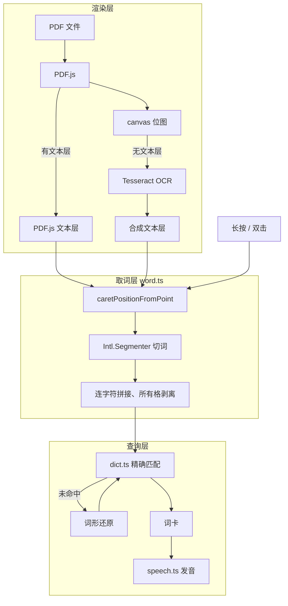

# Dove

在 PDF 上长按单词，就地看到释义、音标并听发音。面向用 平板/手机 读英文原著的人。

## 产品定位

市面上的 PDF 阅读器要么不能查词，要么查词要跳出应用；词典应用又读不了 PDF。
Dove 只解决一件事：**让「读到生词」和「查到词义」之间的距离尽可能短**。

由此推出三条不妥协的约束：

| 约束 | 原因 |
|---|---|
| **扫描版 PDF 必须能用** | 中文用户手上的英文原著、影印教材大多是扫描件，不支持等于不可用 |
| **查词必须离线且即时** | 联网查词有延迟、要授权、会断网，打断阅读节奏 |
| **网页形态，不做原生应用** | 免安装、免上架，一个链接跨 iPad / iPhone / Mac / Android |

不做的事：阅读进度云同步、批注、社交、付费体系。

## 功能

- **长按 / 双击取词** — 触屏长按 400ms，桌面双击，两种手势并存
- **离线词典** — 58226 词条，含音标、词性、中文释义，压缩后 3.7MB
- **词形还原** — `ran → run`、`conveys → convey`，43013 条变形映射
- **扫描件 OCR** — 无文本层的页面自动识别，取词体验与普通 PDF 一致
- **发音** — Web Speech API，自动挑选系统里的自然音色
- **跨行断词还原** — 行尾 `under-` 与次行 `standing` 合并为 `understanding`

## 架构



设计上最关键的一点：**OCR 不另起一套取词逻辑**。识别结果被合成为与 PDF.js
结构相同的透明文本层，因此取词层对上游是谁完全无感，扫描件与普通 PDF 共用同一条
代码路径。详见 [docs/architecture.md](docs/architecture.md)。

## 快速开始

```bash
pnpm install
npm run dict     # 首次必须执行：生成离线词典（会下载约 63MB 的 ECDICT 源数据）
npm run dev
```

`npm run dev` 会打印局域网地址，平板连同一 Wi-Fi 即可真机调试。

```bash
npm test         # 单元测试（node --test，无额外依赖）
npm run e2e      # 端到端测试，需先 npm run dev
npm run build    # 生产构建到 dist/
npm run sample   # 重新生成测试样张
```

## 交互

| 设备 | 取词方式 |
|---|---|
| 桌面（鼠标） | 双击单词，或按住 400ms |
| 触屏（平板 / 手机） | 长按 400ms |

已验证平台：macOS Chrome、iPadOS、iOS。

## 文档

| 文档 | 内容 |
|---|---|
| [docs/architecture.md](docs/architecture.md) | 模块职责、数据流、三条关键路径的实现细节 |
| [docs/decisions.md](docs/decisions.md) | 技术选型及其理由，含被否决的方案 |
| [docs/pitfalls.md](docs/pitfalls.md) | 已踩过的坑与根因，改动前务必一读 |
| [docs/testing.md](docs/testing.md) | 测试策略与全部用例清单 |

## 技术栈

Vite + TypeScript，不使用前端框架（[理由](docs/decisions.md#不使用前端框架)）。
运行时依赖只有 `pdfjs-dist` 与 `tesseract.js`，全部资源自托管，断网可用。

## 许可与数据来源

- 词典数据：[ECDICT](https://github.com/skywind3000/ECDICT)（MIT）
- OCR：[Tesseract.js](https://github.com/naptha/tesseract.js)（Apache-2.0）
- 渲染：[PDF.js](https://github.com/mozilla/pdf.js)（Apache-2.0）
