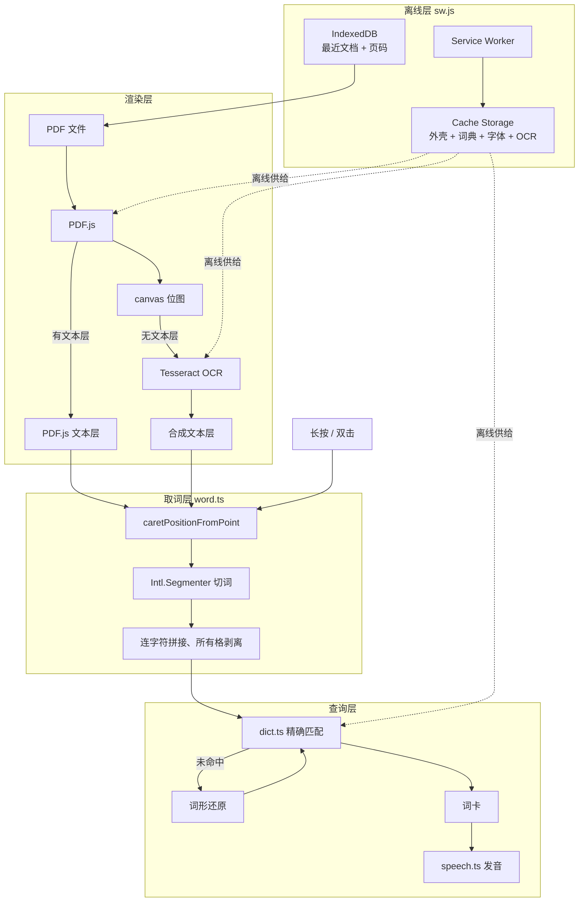

# Dove

在 PDF 上长按单词，就地看到释义、音标并听发音。面向用 平板/手机 读英文原著的人。

## 产品定位

市面上的 PDF 阅读器要么不能查词，要么查词要跳出应用；词典应用又读不了 PDF。
Dove 只解决一件事：**让「读到生词」和「查到词义」之间的距离尽可能短**。

由此推出三条不妥协的约束：

| 约束 | 原因 |
|---|---|
| **扫描版 PDF 必须能用** | 中文用户手上的英文原著、影印教材大多是扫描件，不支持等于不可用 |
| **查词必须离线且即时** | 联网查词有延迟、要授权、会断网，打断阅读节奏 |
| **网页形态，不做原生应用** | 免安装、免上架，一个链接跨 iPad / iPhone / Mac / Android |
| **装上之后彻底不依赖网络**（v2.0） | 读书的场合常常没网：飞机、地铁、山里。有一处要联网，约束就等于没有 |

不做的事：阅读进度云同步、批注、社交、付费体系。

## 功能

- **长按 / 双击取词** — 触屏长按 400ms，桌面双击，两种手势并存
- **离线词典** — 58226 词条，含音标、词性、中文释义，压缩后 3.7MB
- **词形还原** — `ran → run`、`conveys → convey`，43013 条变形映射
- **扫描件 OCR** — 无文本层的页面自动识别，取词体验与普通 PDF 一致
- **发音** — Web Speech API，自动挑选系统里的自然音色
- **跨行断词还原** — 行尾 `under-` 与次行 `standing` 合并为 `understanding`
- **可安装、全离线**（v2.0）— 装到主屏后连词典与 OCR 引擎一起离线可用
- **最近阅读**（v2.0）— 读过的书存在本地，点开即续读到上次的页码
- **自诊断**（v2.1）— 真机上点顶栏的「诊断」即可看到环境、能力自检、离线缓存明细与日志

## v2.0：装到主屏，彻底离线

在浏览器里打开一次，点顶栏的**安装**（iOS 走「分享 → 添加到主屏幕」），之后就是一个
独立图标的应用。首次安装约 1.8MB，随后在后台补齐约 12.7MB 的离线资源，顶栏会显示进度；
补齐后断网也能查词、翻页、识别扫描件。

| 能力 | 说明 |
|---|---|
| 离线阅读与查词 | 应用、词典、字体、OCR 引擎全部进 Cache Storage |
| 最近阅读 | PDF 与页码存在 IndexedDB，最多 10 本 / 400MB，超出淘汰最久未读的 |
| 系统文件入口 | Android / 桌面可从文件管理器「用 Dove 打开」，或从别的应用分享过来 |
| 版本更新 | 有新版本时顶栏出现「新版本 · 刷新」，由用户决定何时切换 |

离线资源分两批下载：**外壳**（应用本体，约 1.8MB）在 Service Worker 安装时必须拿全，
**其余**（词典 3.7MB、cmaps 与字体 1.8MB、pdfjs wasm 1.5MB、OCR 引擎与语言包 5.8MB）由页面在加载完成后触发，逐个文件跳过
已缓存的——弱网中断后下次打开会自动续上，而不是从头再来。

> OCR 核心有 SIMD / relaxed-SIMD / 基础三个变体各约 4MB，运行时只会用其中一个。
> Service Worker 自己做 WebAssembly 特性探测，只缓存会被选中的那一个。

## v2.1：真机上的自诊断

平板和手机上没有 devtools：连不上电脑、看不到 console、复现不了就问不出原因。
顶栏的**诊断**按钮打开一个整屏面板，四节内容：

| 一节 | 回答的问题 |
|---|---|
| 环境 | 版本、UA、是否已安装、视口与 DPR、在线与否、是不是安全上下文 |
| 能力自检 | 切词、词典解压、caret 取词、文本层对齐、SW、IndexedDB、WebAssembly、语音，逐项 ✓/✗ |
| 运行时 | SW 状态、缓存版本、**离线资源缺了哪几个文件**、存储占用、词典条数、当前页、画布上有没有墨迹 |
| 日志 | 本次会话 + **上一次会话**的日志，含第三方库的告警与未捕获异常 |

点「复制」得到一份纯文本报告，直接发给开发者即可。另有「重置缓存」——
卡在某个坏掉的缓存版本上时的逃生口，它清掉离线缓存并注销 SW，不动最近阅读的书。

两个设计要点：

- **日志从内联脚本开始收**，不等模块加载。模块因浏览器过旧而解析失败时页面会彻底空白，
  那正是最需要日志的时刻；此时点「诊断」仍会把日志倒在页面上。
- **日志跨会话保留**（localStorage，400 条上限）。崩溃或自动刷新之后，内存里的日志
  已经没了，面板顶部那份「上次会话」才是现场。

## 架构



设计上最关键的一点：**OCR 不另起一套取词逻辑**。识别结果被合成为与 PDF.js
结构相同的透明文本层，因此取词层对上游是谁完全无感，扫描件与普通 PDF 共用同一条
代码路径。详见 [docs/playbook/architecture.md](docs/playbook/architecture.md)。

## 快速开始

```bash
pnpm install
pnpm run dict     # 首次必须执行：生成离线词典（会下载约 63MB 的 ECDICT 源数据）
pnpm run dev
```

`pnpm run dev` 会打印局域网地址，平板连同一 Wi-Fi 即可真机调试。

```bash
pnpm test         # 单元测试（node --test，无额外依赖）
pnpm run e2e      # 端到端测试，需先 pnpm run dev
pnpm run e2e:pwa # Playwright PWA 离线端到端，自行构建、关闭 preview 并生成报告
pnpm run e2e:devices # PC / iPhone / iPad / Android Pad 的本地设备模拟矩阵
pnpm run test:ci # 与 GitHub Actions 相同的完整检查
pnpm run build    # 生产构建到 dist/
pnpm run sample   # 重新生成测试样张
```

Service Worker 只在生产构建中启用，`pnpm run dev` 下不注册——否则改一行代码就要跟缓存
搏斗。要验证离线行为请用 `pnpm run e2e:pwa` 或 `pnpm run build && pnpm run preview`。
Cloudflare Pages + BrowserStack 真机环境的配置、运行命令与限制见
[PWA E2E Playbook](docs/playbook/pwa-e2e-playbook.md)。

### 在手机 / Pad 上装起来

**Service Worker 只在安全上下文里注册**，`http://192.168.x.x` 不算（只有 `localhost` 与
HTTPS 算）。所以 `pnpm run dev` 打印的那个局域网地址测取词可以，测安装不行——
`beforeinstallprompt` 根本不会触发，安装按钮点下去只会告诉你差一个 https。

```bash
pnpm run serve         # 局域网 https，mkcert 签本机证书
pnpm run serve:tunnel  # cloudflared 公网隧道，设备端零配置
```

本地地址和 `serve:tunnel` 只用于开发调试，不作为验收链接。需要交付验收时，将已测试提交推送到
`stage` 分支；GitHub Actions 在公网 Preview 四端模拟通过后，才发布到固定地址
`https://stage.dove.ethanyin.com`。交付时同时记录应用版本、stage Git SHA、Actions Run 和固定链接。

`master` 的长期在线地址是 `https://dove-master.pages.dev`。每次 `master` push 也必须先通过完整
PWA 基线、Preview 和四端模拟，随后才更新该固定站点；若门禁失败，线上继续保留上一版。

`pnpm run serve` 会起两个服务：

| 端口 | 协议 | 用途 |
|---|---|---|
| 4180 | **http** | 证书引导页：发根证书，并实时探测这台设备信任上了没有 |
| 4173 | https | 应用本体 |

引导页之所以必须是明文 http，是因为根证书若也从那个 https 地址取，就成了
「要先信任才能拿到用来信任的东西」的死循环。手机打开 `http://<局域网IP>:4180`，
照页面上的两步走即可。

> iOS 装完描述文件后，**还要**去「设置 → 通用 → 关于本机 → 证书信任设置」把它打开。
> 这一步最容易漏，漏了等于没装——引导页上的探测会告诉你到底成没成。
>
> 设备信任证书就够了，本机不必执行 `mkcert -install`。

| | 设备端要做什么 | 代价 |
|---|---|---|
| `serve` | 装一次根证书 | IP 变了要重签，脚本每次启动自动重签 |
| `serve:tunnel` | 什么都不用做 | 地址每次都变；隧道会拆掉 `Content-Encoding`，词典按 9.9MB 明文传输，预缓存约 19MB 而非 12.7MB |

## 交互

| 设备 | 取词方式 |
|---|---|
| 桌面（鼠标） | 双击单词，或按住 400ms |
| 触屏（平板 / 手机） | 长按 400ms |

已验证平台：macOS Chrome、iPadOS、iOS。

安装方式因平台而异：Chrome / Edge（Android、桌面）会触发顶栏的**安装**按钮；
iOS / iPadOS 没有对应接口，只能在 Safari 里「分享 → 添加到主屏幕」，点安装按钮会给出指引。

## 文档

| 文档 | 内容 |
|---|---|
| [docs/playbook/architecture.md](docs/playbook/architecture.md) | 模块职责、数据流、三条关键路径的实现细节 |
| [docs/playbook/decisions.md](docs/playbook/decisions.md) | 技术选型及其理由，含被否决的方案 |
| [docs/playbook/pitfalls.md](docs/playbook/pitfalls.md) | 已踩过的坑与根因，改动前务必一读 |
| [docs/playbook/testing.md](docs/playbook/testing.md) | 测试策略与全部用例清单 |
| [docs/playbook/pwa-e2e-playbook.md](docs/playbook/pwa-e2e-playbook.md) | Playwright PWA E2E 环境、版本回溯与新增用例流程 |
| [docs/agents/README.md](docs/agents/README.md) | AllInOne / Agent Teams 模式选择、角色索引与模型无关原则 |
| [docs/agents/team-protocol.md](docs/agents/team-protocol.md) | 团队启动门禁、协作、文件所有权和交接协议 |
| [docs/agents/pmo.md](docs/agents/pmo.md) | PMO 主 Agent 的用户沟通与团队编排职责 |
| [docs/agents/pm.md](docs/agents/pm.md) | PM Agent 的需求澄清、Spec 与验收标准职责 |
| [docs/agents/rd.md](docs/agents/rd.md) | RD Agent 的技术设计、Coding、调试与单元测试职责 |
| [docs/agents/qa.md](docs/agents/qa.md) | 独立 QA Agent 的回归流程、证据标准与报告模板 |
| [docs/agents/ops.md](docs/agents/ops.md) | 独立 Ops Agent 的环境启用、排障、维护与事故模板 |
| [docs/agents/all-in-one.md](docs/agents/all-in-one.md) | 简单需求的单 Agent 顺序工作与升级规则 |
| [docs/spec/README.md](docs/spec/README.md) | 每次迭代的需求与技术 Spec 入口及命名约定 |

## 技术栈

Vite + TypeScript，不使用前端框架（[理由](docs/playbook/decisions.md#不使用前端框架)）。
运行时依赖只有 `pdfjs-dist` 与 `tesseract.js`，全部资源自托管，断网可用。
Service Worker 为手写，未引入 Workbox 或 vite-plugin-pwa（[理由](docs/playbook/decisions.md#手写-service-worker)）。

## 许可与数据来源

- 词典数据：[ECDICT](https://github.com/skywind3000/ECDICT)（MIT）
- OCR：[Tesseract.js](https://github.com/naptha/tesseract.js)（Apache-2.0）
- 渲染：[PDF.js](https://github.com/mozilla/pdf.js)（Apache-2.0）
